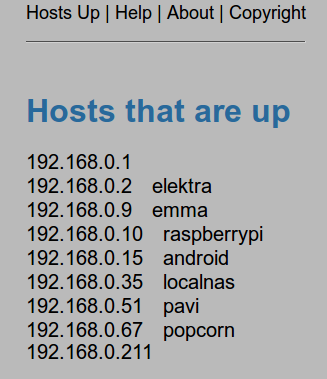

# Hosts Up #
Hosts Up is a collection of small PHP scripts and HTML documents I've made to
help me keep track of live hosts on my network at home and at work. Each time
the webpage is refreshed a new ping sweep on the network is performed. To see
which ports are open one can just click on a host and another script fires up an
Nmap scan of the host. The result is showed on the webpage. Both the ping sweep
and scans are using Nmap. Hence Nmap is required aswell as PHP's ability to
exeucte Nmap.

## Some screenshots ##

